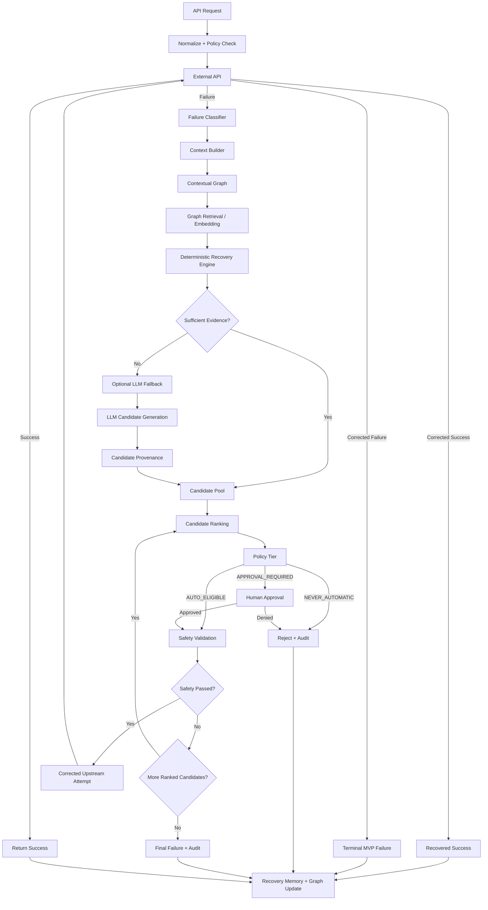

# Self-Correcting API Broker via Contextual Graph Learning

## Final Engineering Specification

This project is an AI/ML-powered backend reliability system that sits between an application and external APIs.

Its purpose is not to blindly retry failed requests. It detects a recoverable API failure, builds a contextual representation of the situation, searches previously learned recovery knowledge, proposes and ranks safe corrections, and executes at most one corrected upstream attempt in the MVP.

The system improves over time through **Recovery Memory**: successful novel solutions discovered through the LLM fallback are stored with their complete situation, provenance, validation evidence and outcome. Later, similar failures can be resolved deterministically without invoking the LLM.

## Core principle

> **Deterministic first. LLM only when evidence is insufficient. Every executed correction is safety-gated. Successful novel LLM recoveries become validated recovery memory, not automatically trusted rules.**

## Final recovery flow



## MVP retry invariant

The MVP permits **maximum total upstream executions = 2**:

- Attempt 1: original request
- Attempt 2: one approved corrected request

A rejected candidate does not consume an upstream execution. The system may inspect the next ranked candidate. Once the corrected attempt has executed and failed, the MVP returns a terminal failure rather than recursively attempting more corrections.

## Recovery Memory

A learned correction is stored as a complete case, not merely a rule:

```text
API + endpoint + version
+ request/failure context
+ graph neighborhood
+ candidate
+ source/provenance
+ validation result
+ execution outcome
+ model/version if applicable
+ success/failure history
```

A single successful LLM recovery is **validated knowledge**, but not automatically a high-confidence permanent rule. Repeated successful reuse can increase confidence.

## AI/ML roles

### Graph learning
Graph embeddings are the core contextual retrieval mechanism.

MVP baseline:
- Node2Vec-style embeddings.

Research extension:
- GraphSAGE.

The project should compare both rather than claiming GNN superiority in advance.

### LLM
Gemini/Groq is a **fallback candidate generator** only.

The LLM is invoked automatically when:
- the API/failure is valid and understood,
- deterministic retrieval/candidates exist or the context is sufficient,
- but no candidate meets the configured confidence/evidence threshold.

The LLM cannot bypass:
- candidate ranking,
- policy tier,
- deterministic safety validation,
- execution limits.

### CNN
CNN is **not part of the core architecture**. It would only be introduced if an experiment later proves that convolution over a meaningful structured representation of request/response/error sequences adds value. Do not add CNN for technology-count purposes.

## Final stack direction

- Frontend: Next.js + TypeScript
- Backend: Python + FastAPI
- Database: PostgreSQL
- Vector storage: pgvector
- Graph representation: relational graph tables; NetworkX for analysis/in-process graph operations
- Embedding baseline: Node2Vec
- GNN research extension: GraphSAGE
- HTTP: HTTPX
- Validation: Pydantic + deterministic policy engine
- AI providers: Gemini/Groq through a provider abstraction
- Local development: Docker Compose
- Optional Redis only if profiling/background work justifies it

## Explicitly deferred

Do not build these in the MVP:
- Python/TypeScript SDK
- CLI
- VS Code extension
- Kubernetes
- service mesh
- Kafka
- dedicated graph database
- multi-agent architecture
- CNN
- unrestricted autonomous code generation

Productization comes only after recovery accuracy and evaluation are established.

## What success means

A successful project demonstration must show:

```text
real request
→ real API failure
→ contextual diagnosis
→ deterministic recovery attempt
OR
→ insufficient evidence
→ LLM escalation
→ candidate validation
→ safe corrected attempt
→ real outcome
→ recovery memory
→ graph update
→ future deterministic reuse
```

The research claim is not that self-correction itself is new. The intended contribution is the **contextual graph-learning + recovery-memory + confidence-gated LLM fallback + deterministic safety architecture**, evaluated against meaningful baselines.

## Antigravity operating model

Use `MASTER_PROMPT.md` once at the beginning of the implementation session.

The intended workflow is **not**:

```text
Plan → external review → regenerate plan → external review → repeat
```

Instead:

```text
Locked specification
        ↓
Antigravity internal planning
        ↓
Implementation
        ↓
Tests + security + architecture verification
        ↓
Progress report
        ↓
Next ticket
```

`docs/CHANGE_CONTROL.md` defines when Antigravity is allowed to decide autonomously and when it must stop for human review.

Routine implementation decisions should never become approval requests. Human review is reserved for genuine architectural changes, security violations, research-definition changes, material ambiguity, or external blockers.
