# Technical Architecture Document

## 1. Architectural principle

The system separates:
1. request execution,
2. failure understanding,
3. contextual retrieval,
4. deterministic recovery,
5. optional AI reasoning,
6. candidate ranking,
7. safety/policy,
8. bounded execution,
9. recovery memory.

The LLM is never the execution authority.

## 2. System architecture

```mermaid
flowchart LR
    U[Client] --> G[API Gateway/Broker API]
    G --> N[Normalizer]
    N --> P[Pre-Policy]
    P --> X[Upstream Execution]

    X -->|Success| O[Outcome Store]
    X -->|Failure| F[Failure Classifier]

    F --> C[Context Builder]
    C --> GR[Contextual Graph]
    GR --> EM[Embedding / Graph Learning]
    EM --> RT[Context Retrieval]

    RT --> DR[Deterministic Recovery]
    DR --> CG[Confidence Gate]

    CG -->|Sufficient| CP[Candidate Pool]
    CG -->|Insufficient| LLM[Optional Gemini/Groq]

    LLM --> CP
    CP --> RK[Candidate Ranking]
    RK --> PO[Policy Tier]

    PO -->|AUTO| SV[Safety Validator]
    PO -->|APPROVAL| HA[Human Approval]
    PO -->|NEVER| AJ[Audit + Reject]

    HA -->|Approved| SV
    SV --> EX[Corrected Attempt]
    EX --> X

    O --> RM[Recovery Memory]
    AJ --> RM
    RM --> GR
```



## 3. Component responsibilities

### Broker API
Authenticated entry point.

### Normalizer
Produces canonical request context:
- API,
- endpoint,
- version,
- method,
- schema signature,
- parameter metadata,
- idempotency metadata.

### Upstream Execution
HTTPX-based execution with timeout, redirect policy, host policy and telemetry.

### Failure Classifier
Deterministic first; model-assisted classification only if needed.

### Context Builder
Builds a normalized failure context without secrets.

### Contextual Graph
Relational nodes/edges representing API relationships and recovery cases.

### Embedding Service
Provides vector representations for contextual retrieval.

### Deterministic Recovery Engine
Looks for:
- exact validated recovery memory,
- schema-compatible transformations,
- configured provider rules,
- historical successful corrections,
- safe transient retry behavior.

### Confidence Gate
Decides whether deterministic evidence is sufficient.

### LLM Fallback
Generates structured candidates only when deterministic evidence is insufficient.

### Candidate Ranker
Combines graph similarity, history, schema compatibility, failure match, provenance and risk.

### Policy Engine
Assigns:
- AUTO_ELIGIBLE,
- APPROVAL_REQUIRED,
- NEVER_AUTOMATIC.

### Safety Validator
Fail-closed deterministic checks.

### Recovery Memory
Persists recovery cases and promotes successful cases through knowledge maturity.

## 4. Graph model

### Nodes

```text
API
SERVICE
ENDPOINT
VERSION
PARAMETER
SCHEMA_FIELD
ERROR_TYPE
ERROR_SIGNATURE
REQUEST_CONTEXT
RECOVERY_CASE
CORRECTION
OUTCOME
MODEL_RUN
```

### Edges

```text
HAS_ENDPOINT
HAS_VERSION
HAS_PARAMETER
HAS_SCHEMA_FIELD
PRODUCES_ERROR
SIMILAR_CONTEXT
PROPOSED_CORRECTION
CORRECTED_BY
SUCCEEDED_WITH
FAILED_WITH
DISCOVERED_BY
VALIDATED_BY
DEPENDS_ON
```

## 5. Recovery case graph

A recovery case connects:

```text
API
 └─ Endpoint
     └─ Version
         └─ Failure Context
              ├─ Error Signature
              ├─ Request Schema
              └─ Graph Neighborhood
                     │
                     ▼
                Correction
                     │
              ┌──────┴──────┐
              ▼             ▼
          Validation      Outcome
              │             │
              └──────┬──────┘
                     ▼
               Recovery Case
```

## 6. Graph embedding strategy

### Baseline

Use Node2Vec/DeepWalk-style embeddings to establish a reproducible graph-learning baseline.

### Research model

Use **GraphSAGE** as the primary GNN extension.

Why GraphSAGE:
- inductive behavior is appropriate when new APIs/endpoints/errors appear,
- it can aggregate neighborhood information,
- it provides a meaningful comparison against static graph embeddings.

GraphSAGE is not assumed to be superior. It must be experimentally evaluated.

### Embedding output

Each contextual node/case can have:
- vector,
- model name,
- model version,
- dimension,
- timestamp.

## 7. Retrieval

Retrieve:
1. exact/same endpoint historical cases,
2. same error signature,
3. same parameter/schema relationship,
4. nearest graph contexts,
5. successful recovery cases,
6. relevant failed recovery cases.

Rank retrieval by contextual similarity and provenance quality.

## 8. Deterministic recovery

Priority order:

```text
1. Established recovery memory
2. Validated recovery memory
3. Provider-configured safe mappings
4. Schema-compatible transformations
5. Safe transient retry policy
```

A deterministic candidate must carry evidence.

## 9. Confidence gate

Example initial score:

```text
deterministic_confidence =
  0.30 graph_similarity
+ 0.25 historical_success
+ 0.20 schema_compatibility
+ 0.15 failure_match
+ 0.10 provenance_quality
- risk_penalty
```

These weights are configurable starting points, not scientific truths.

The gate compares the resulting score against a configured threshold and minimum evidence requirements.

## 10. LLM escalation

LLM is invoked only if:
- deterministic candidates do not meet the threshold,
- the failure class is eligible for reasoning,
- context is sufficient to form a safe prompt,
- provider/model budget allows invocation.

The prompt contains:
- normalized failure,
- API/endpoint/version,
- relevant graph context,
- deterministic candidates considered,
- allowed action types,
- forbidden actions.

The model returns strict structured candidates.

## 11. Candidate ranking

Candidate score may combine:

```text
graph_similarity
historical_success
schema_compatibility
failure_match
provenance_quality
source reliability
risk penalty
```

LLM confidence is evidence, not authority.

## 12. Policy and safety

Three policy tiers:

```text
AUTO_ELIGIBLE
APPROVAL_REQUIRED
NEVER_AUTOMATIC
```

Every executable candidate must pass deterministic safety checks.

## 13. Candidate fallback

If a candidate is rejected before execution:
- record rejection,
- do not increment upstream attempt count,
- inspect next ranked candidate,
- stop when candidates are exhausted.

## 14. Execution invariant

MVP:

```text
attempt_count = 0

original request
→ attempt_count = 1

approved corrected request
→ attempt_count = 2

no further upstream execution
```

If corrected attempt fails:
- classify/store resulting failure,
- record recovery failure,
- update recovery memory appropriately,
- return terminal failure.

Do not recursively launch a third upstream attempt.

## 15. Recovery Memory lifecycle

```text
LLM Candidate
     ↓
PROPOSED
     ↓
Safety + execution
     ↓
Success
     ↓
VALIDATED
     ↓
Repeated successful reuse
     ↓
ESTABLISHED
```

Failed candidate:
- retain as negative evidence when useful,
- never promote as successful knowledge.

## 16. Database

Core tables:

```text
users
apis
api_endpoints
api_versions
api_parameters
request_events
failure_events
graph_nodes
graph_edges
embedding_records
recovery_cases
correction_candidates
recovery_attempts
policies
approval_requests
audit_events
model_runs
evaluation_runs
```

## 17. Vector storage

Use pgvector for:
- graph/context embeddings,
- recovery case embeddings.

Do not create a separate vector database for MVP.

## 18. NetworkX

NetworkX may be used for:
- graph analysis,
- embedding preprocessing,
- offline experiments,
- visualization preparation.

It is not the authoritative persistence layer.

## 19. External API safety

- registered hosts preferred,
- strict redirect handling,
- SSRF protections,
- timeouts,
- TLS verification enabled,
- auth invariants,
- request body limits.

## 20. Observability

Every request/recovery gets:
- correlation ID,
- request ID,
- recovery ID if applicable,
- upstream latency,
- failure type,
- candidate source,
- selected candidate,
- policy decision,
- validation decision,
- attempt count,
- final outcome.

## 21. Failure modes

If graph unavailable:
- deterministic exact rules may continue if safe,
- otherwise fail closed or degrade explicitly.

If embedding service unavailable:
- exact/historical deterministic retrieval may continue.

If LLM unavailable:
- deterministic path continues; no automatic dependency on LLM.

If database unavailable:
- do not silently execute recovery without required audit/state guarantees.

## 22. Deployment

MVP:

```text
Next.js
FastAPI
PostgreSQL + pgvector
```

Docker Compose for local development.

Redis is optional only if measured workload requires caching/queues.

## 23. Deferred architecture

Dedicated graph database, Kafka, service mesh, Kubernetes, SDKs and extensions are future work.

## 24. Architecture invariants

1. AI proposes; system decides.
2. Safety is deterministic.
3. Deterministic recovery is attempted before LLM.
4. LLM fallback is conditional.
5. Successful LLM recovery becomes provenance-aware memory.
6. Memory can later reduce LLM invocation.
7. Maximum upstream executions in MVP is two.
8. No unsafe action is automatically executed.
